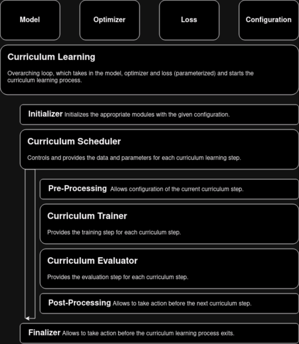

# Physical Informed Neural Networks (PINNs) for Solving Partial Differential Equations (PDEs)

This repository contains example for PINN with curriculum learning for solving PDEs. The code is based on the paper [Krishnapriyan, Aditi, et al. "Characterizing possible failure modes in physics-informed neural networks." Advances in Neural Information Processing Systems 34 (2021): 26548-26560.](https://proceedings.neurips.cc/paper/2021/file/df438e5206f31600e6ae4af72f2725f1-Paper.pdf) ([Archive Link](https://arxiv.org/abs/2109.01050))

## Overview

### Curriculum Learning implementation



### Notes on WandB

#### Sweeps

If you want to configure a sweep, you need to re-define the whole block in the sweep block. This is due to how wandb handles nested dictionaries. 
The following is an example taken from `sweep-mini-test.yaml`, re-defining the training block in the sweep block giving epochs 10 and 20 as values for the sweep, while keeping the stopping block the same (compare to `online-mini-test.yaml`). Also note, the original training needs to be removed.

```yaml
sweep:
  name: "test-adam-curriculum-learning-sweep"
  description: "Test sweep for Adam Optimizer and Curriculum Learning"
  method: "random"
  metric:
    name: "Loss Overall"
    goal: "minimize"
  parameters:
    training:
      parameters:
        epochs:
          values: [10, 20]
        stopping:
          parameters:
            patience:
              value: 10
```

Note, currently conditional sweeps are not supported, meaning that we have to either carefully choose the parameters or run multiple sweeps over the dependent parameters. Another approach from this [issue](https://github.com/wandb/wandb/issues/1487).

## Research Questions

### Main Research Questions

- [ ] Sample size of training points
- [ ] Noise in training data

### Further Research Questions

- [ ] Different sampling methods and sizes for training points
- [ ] Model architecture (e.g. number of layers, number of neurons per layer, activation functions, etc.)

### Other Research Questions

- [ ] LBFGS seems promising, but *slow* and **unstable** (e.g. sometimes it works, sometimes it doesn't)
  - [ ] Why is it unstable?
  - [ ] How to make it more stable?
  - [ ] Find good hyperparameters for LBFGS


## To Do

### Implementation

- [ ] Move Loss to util.init module
- [ ] Add random sampling of points in dataset
- [ ] Check for `TODO`'s in code
- [ ] Clean-Up Code (e.g. remove unused imports, Keys, etc.)
- [ ] `YAML`; some how reduce? maybe split sweeps and normal runs?

### Training

- [ ] Useful metrics to track?
- [ ] Toleration for loss? (e.g. if loss is below a certain threshold * tolerance, stop training)

### Validation

- [ ] Useful metrics to track?
- [ ] Plots

### Other

- [ ] Clean-Up Documentation (e.g. `README.md`, `requirements.txt`, `LICENSE`, etc.)
- [ ] Publish? (e.g. `requirements.txt`, `LICENSE`, etc.)
