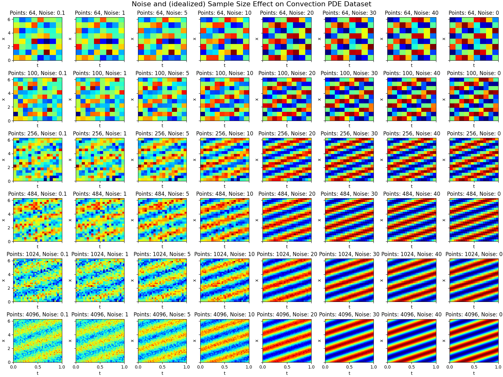
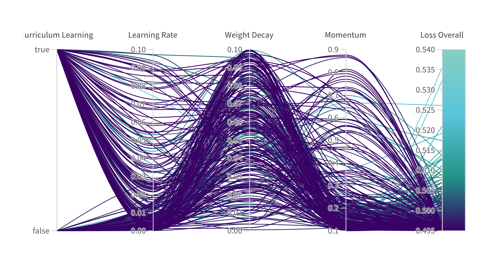
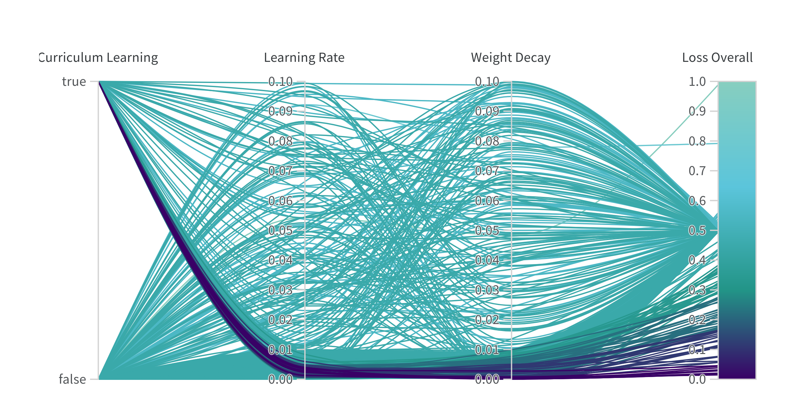
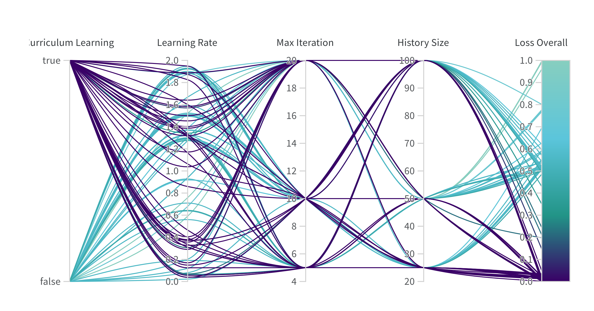
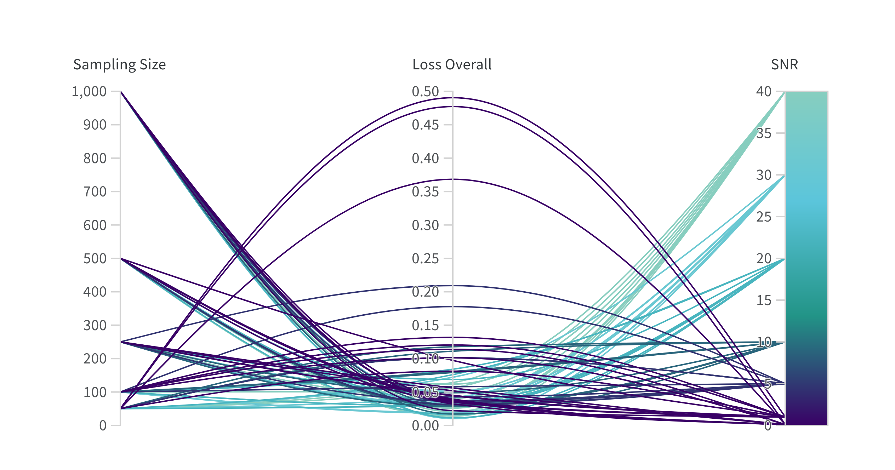
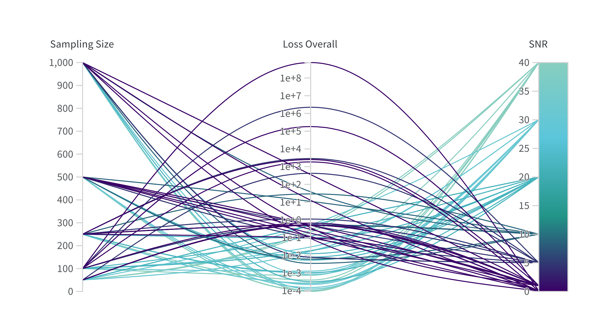
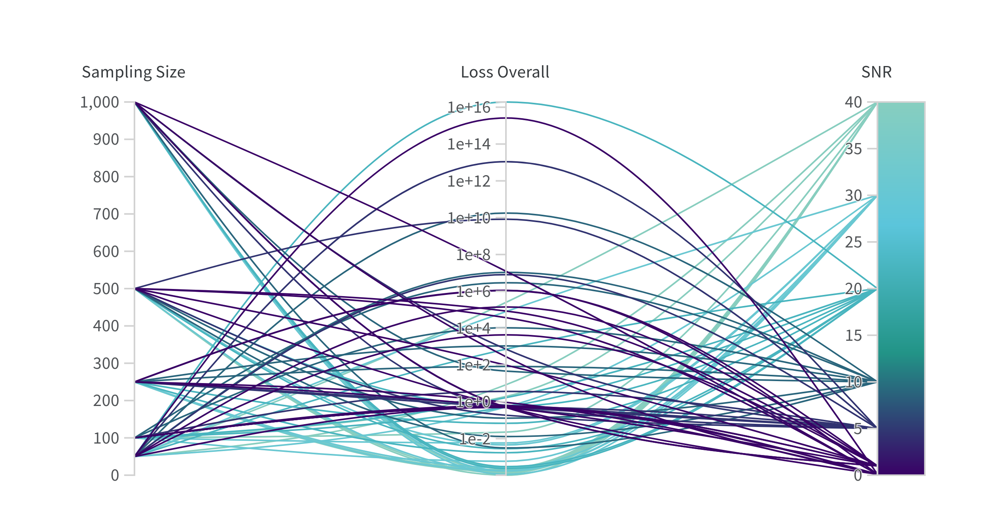
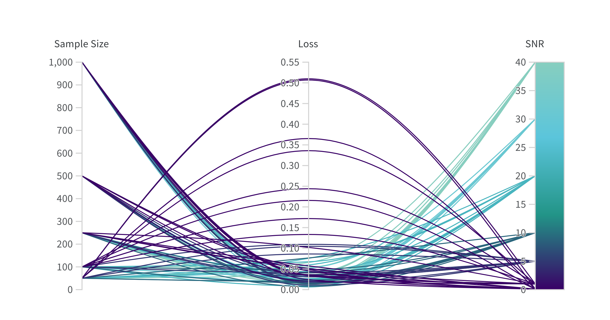
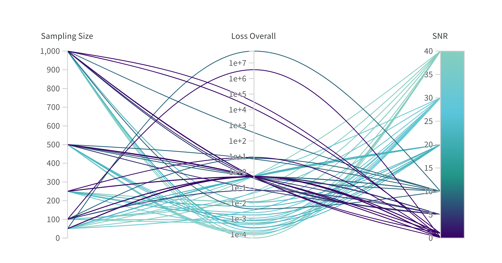

<!-- _paginate: false -->
<!-- _class: lead -->
<!-- center -->
# Physics-Informed Neural Networks
### using Curriculum Learning

---

### Background

#### What are PINNs?

PINNs are a class of neural networks which <mark>respect in their output the governing laws of physics</mark> described through differential equations. This can be achieved by introducing physical domain knowledge by <mark>PDEs</mark> into the network using the <mark>loss function</mark>.

#### What is curriculum learning in the context of PINNs?

Within this context, curriculum learning is a training strategy that <mark>gradually increases the complexity of the training data</mark>, allowing the network to train on <mark>simpler examples first</mark> and then gradually increasing the complexity.

---

### Motivation

Neural networks are <mark>data-driven</mark> models, learning from data. However, <mark>noisy and sparse data</mark> can have significant <mark>impact on the performance</mark> of neural networks and is a research topic in itself. In the context of <mark>PINNs</mark>, most studies assume mostly <mark>noise-free</mark> data.

### Research Question

<mark>Krishnapriyan, Aditi, et al. (2021)</mark> analyzed the performance of PINNs and introduced and showed improvements through <mark>curriculum learning</mark>.

<mark>Our aim</mark> is to build on their work, specifically on the <mark>curriculum learning</mark> approach, and investigate the <mark>effects of sampling size and noise</mark> in the training data on the performance of PINNs.

--- 

#### Visualizing the effect of sampling size and noise
(Note that the sample are idealized, as we assume that the samples are equidistantly distributed over the domain.)

---

## The Classroom

Our first goal is to <mark>reproduce the results</mark> of Krishnapriyan, Aditi, et al. (2021) and <mark>verify</mark> against the baseline results, which does not use curriculum learning. Furthermore, we aim to find <mark>optimal hyperparameters</mark> for the optimizers used in the following experiments.

This is done by learning the <mark>Convection-Diffusion Equation</mark> and comparing the results of the <mark>loss function</mark> for a convection coefficient of $c = 30$.

---

### Setup

#### Convection-Diffusion Equation
The PDE in the experiments is the <mark>Convection–Diffusion Equation</mark> with no diffusion term and a  <mark>scalar convection</mark> term with a <mark>continuous boundary</mark> as well as a <mark>sine wave</mark> as the <mark>initial condition</mark>, given by
$$
\frac{\partial u}{\partial t} + c \frac{\partial u}{\partial x} = 0
$$
with $c$ being the convection coefficient and $u(x, t)$ is the primitive function of the CDE.

---

### Setup

#### Data Generation

The data is generated by <mark>random sampling 100 points</mark> from the domain $\Omega = [0, 1] \times [0, 2\pi]$ consisting of 10000 equidistant points. The corresponding <mark>labels are the analytical solution</mark> of the CDE. Additionally, the data is augmented with <mark>Gaussian noise</mark> to achieve a <mark>signal-to-noise ratio (SNR) of 50</mark>.

---

### Setup

#### Model
Fully connected neural network with <mark>3 hidden layers and 50 neurons per layer</mark>. The <mark>activation function</mark> is the <mark>hyperbolic tangent</mark> function. The input of the network is the spatial coordinate $x$ and temporal coordinate $t$. The output of the network is $u(x, t)$.

---

### Setup

#### Loss Function
The loss function is the <mark>mean squared error (MSE) between the predicted and the analytical solution of the CDE</mark> and the <mark>PDE of the learned function</mark>. The loss function is given by

$$\begin{align*} 
    \mathcal{L}(\hat u, u \mid \theta) &= \mathcal{L}_{\text{PDE}}(\hat u \mid \theta) + \mathcal{L}_{\text{MSE}}(\hat u, u \mid \theta) \\
    \mathcal{L}_{\text{PDE}}(\hat u \mid \theta) &= \frac{\partial \hat u}{\partial t} + c \frac{\partial \hat u}{\partial x}\\
    \mathcal{L}_{\text{MSE}}(\hat u, u \mid \theta) &= \frac{1}{n}\sum^n_{i=1}(\hat{u}(x_i, t_i) - u(x_i, t_i))^2
\end{align*}$$

where $\hat u$ is the predicted value of the CDE, $u$ is the analytical solution of the CDE, $\theta$ are the learned weights and biases of the network.

---

### Setup

#### Optimizer

| Optimizer | Learning Rate | Weight Decay | Momentum | Nesterov | Max Iterations | History Size |
| --------- | ------------- | ------------ | -------- | -------- | -------------- | ------------ |
| SGD       | [.0001, .1]   | [0, .1]      | [.1, .9] | Yes, No  | -              | -            |
| Adam      | [.00001, .1]  | [0, .1]      | -        | -        | -              | -            |
| L-BFGS    | [.01, 2]      | -            | -        | -        | 5, 10, 20      | 25, 50, 100  |

The hyperparameters for the optimizers are found using sweeps with Bayesian optimization on the hyperparameter search space.

---

### Setup

#### Curriculum Learning

During the curriculum learning, the <mark>convection coefficient $c$</mark> is <mark>increased</mark> from 1 to 30 in 30 steps, meaning that during each step the <mark>convection coefficient is increased by 1</mark>. Each step consists of <mark>250 epochs</mark>, <mark>100 samples</mark> from the domain and the <mark>noise</mark> is fixed at a <mark>SNR of 50</mark>.

---

### Results

---

#### Result: Stochastic Gradient Descent Hyperparameter Sweep

---

#### Result: Adam Hyperparameter Sweep

---

#### Result: L-BFGS Hyperparameter Sweep

--- 

## A Crowded and Noisy Classroom

The previous experiment is an idealized scenario, where the data is almost noise-free. However, our goal is to investigate the effects of sampling size and noise in the training data on the performance of PINNs. Therefore, using the <mark>optimal hyperparameters</mark>, we <mark>vary the sample size and noise</mark> to see how they affect the <mark>ability of PINNs to learn the CDE</mark>.

---

### Setup Changes

#### Optimization
| Optimizer              | Learning Rate | Weight Decay | Max Iterations | History Size |
| ---------------------- | ------------- | ------------ | -------------- | ------------ |
| Adam                   | .0025         | .0005        | -              | -            |
| L-BFGS$_{\text{high}}$ | 1.5           | -            | 10             | 25           |
| L-BFGS$_{\text{low}}$  | .15           | -            | 10             | 100          |

The hyperparameters for the optimizers are fixed to the optimal hyperparameters found in the previous experiment.

---

### Setup Changes

#### Sample Size

The sample size is <mark>varied between 10, 50, 100, 500 and 1000 samples</mark>  and randomly sampled from the domain $\Omega = [0, 1] \times [0, 2\pi]$ consisting of 10000 equidistant points.

#### Noise

The signal-to-noise ratio (SNR) is <mark>varied from 0.1, 1, 5, 10, 20, 30 and 40</mark> and added as Gaussian noise to the training data.

---

#### Results: Adam

---

#### Results: L-BFGS$_{\text{high}}$

---

#### Results: L-BFGS$_{\text{low}}$

---

## A Slower Approach on Learning the Subject

Introducing noise can have a <mark>negative effect on the performance</mark>, which can be <mark>reduced</mark> to some degree <mark>by increasing the sample size</mark>. Another approach to possibly reduce the negative effects of noise is to <mark>increase the number of curriculum steps</mark>. 

---

### Setup Changes

#### Curriculum Learning
The <mark>curriculum learning steps are increased from 30 to 60</mark>. The convection coefficient $c$ is increased by 0.5 per curriculum step, starting at 0.5 and ending at 30.

---

#### Results: Adam

---

#### Results: L-BFGS$_{\text{high}}$

---

## Thank you for your attention!