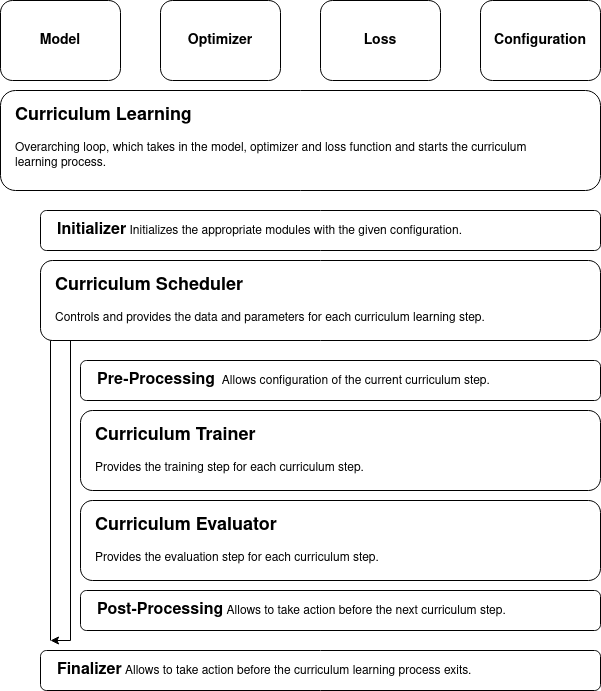

<!-- _paginate: skip -->
<!-- _class: lead -->
<!-- center -->
## Physics-Informed Neural Networks using Curriculum Learning
###### Amel Vatic and <u>Serge Kotchourko</u>, 01.02.2024

---

## Background

---

<!-- paginate: hold -->

##### Background

#### What are PINNs?

PINNs are a class of neural networks which <mark>respect in their output the governing laws of physics</mark> described through differential equations. This can be achieved by <mark>introducing physical domain knowledge</mark> by PDEs <mark>into</mark> the network using the <mark>loss function</mark> [2].

---

##### Background

#### What is curriculum learning in the context of PINNs?

Within this context, curriculum learning is a training strategy that <mark>gradually increases the complexity of the training data</mark>, allowing the network to train on <mark>simpler examples first</mark> and then gradually increasing the complexity [1].

---

<!-- paginate: true -->

## Motivation

Neural networks are <mark>data-driven models</mark>, learning from data. However, <mark>noisy and sparse data</mark> can have significant <mark>impact on the performance</mark> of neural networks and is a research topic in itself. In the <mark>context of PINNs</mark>, most studies <mark>assume mostly noise-free data</mark>.

---

<!-- paginate: hold -->

##### Motivation

#### Visualizing the effect of sampling size and noise

---

<!-- paginate: true -->

## Research Question

<mark>Krishnapriyan, Gholami, et al. (2021)</mark> analyzed the performance of PINNs and introduced and showed improvements through <mark>curriculum learning</mark> [1].

<mark>Our aim</mark> is to build on their work, specifically on the <mark>curriculum learning</mark> approach, and investigate the <mark>effects of sampling size and noise</mark> in the training data on the performance of PINNs.

--- 

## The Classroom

Our first goal is to <mark>reproduce the results</mark> of Krishnapriyan, Gholami, et al. (2021) and <mark>verify against the baseline results</mark>, which does not use curriculum learning. Furthermore, we aim to <mark>find optimal hyperparameters</mark> for the optimizers used in the following experiments.

---

### Setup

---

<!-- paginate: hold -->

##### Setup

#### <mark>Convection-Diffusion Equation</mark>
The PDE in the experiments is the <mark>Convection–Diffusion Equation</mark> with no diffusion term and a  scalar convection term given by
$$
\frac{\partial u}{\partial t} + c \frac{\partial u}{\partial x} = 0
$$
with $c$ being the convection coefficient and $u(x, t)$ is the primitive function of the CDE. The <mark>initial condition</mark> is given by a <mark>sine wave</mark> and the <mark>boundary condition is continuous</mark>.

---

##### Setup

#### Data Generation

The data is generated in the domain <mark>$\Omega = [0, 1] \times [0, 2\pi]$ consisting of 10000 equidistant points</mark>. The corresponding <mark>labels are the analytical solution of the CDE</mark>. Additionally, the sampled data point labels are <mark>augmented with Gaussian noise</mark>.

---

##### Setup

#### Model

The model is a <mark>fully connected neural network with 3 hidden layers, 50 neurons per hidden layer</mark> and the <mark>hyperbolic tangent function</mark> as the <mark>activation function</mark>. The <mark>inputs</mark> to the network are the <mark>spatial and temporal coordinates</mark> $(x, t)$ and the output of the network is $\hat u(x, t)$. 

---

##### Setup

#### <mark>Loss Function</mark>

The loss function is the <mark>mean squared error (MSE) between the predicted and the analytical solution of the CDE</mark> and the <mark>PDE of the learned function</mark>. The loss function is given by

$$\begin{align*} 
    \mathcal{L}(\hat u, u \mid \theta) &= \mathcal{L}_{\text{PDE}}(\hat u \mid \theta) + \mathcal{L}_{\text{MSE}}(\hat u, u \mid \theta) \\
    \mathcal{L}_{\text{PDE}}(\hat u \mid \theta) &= \frac{\partial \hat u}{\partial t} + c \frac{\partial \hat u}{\partial x}
\end{align*}$$

where $\hat u$ is the predicted value of the CDE, $u$ is the analytical solution of the CDE, $\theta$ are the learned weights and biases of the network.

---

##### Setup

#### Optimizer

| Optimizer | Learning Rate | Weight Decay | Momentum | Nesterov | Max Iterations | History Size |
| --------- | ------------- | ------------ | -------- | -------- | -------------- | ------------ |
| SGD       | [.0001, .1]   | [0, .1]      | [.1, .9] | Yes, No  | -              | -            |
| Adam      | [.00001, .1]  | [0, .1]      | -        | -        | -              | -            |
| L-BFGS    | [.01, 2]      | -            | -        | -        | 5, 10, 20      | 25, 50, 100  |

The hyperparameters for the optimizers are found using sweeps with Bayesian optimization on the hyperparameter search space.

---

##### Setup

#### <mark>Curriculum Learning</mark>

During the curriculum learning, the <mark>convection coefficient $c$</mark> is <mark>increased from 1 to 30</mark> in 30 steps. Each step consists of a <mark>common training routine</mark> with 250 epochs, 100 newly random sampled points from the domain with noise fixed at a SNR of 50. 

A <mark>baseline experiment</mark> is also run, where the <mark>convection coefficient is fixed at 30</mark> and the <mark>curriculum learning is not used</mark>.

---

##### Setup

#### <mark>Curriculum Learning</mark>

---

<!-- paginate: true -->

## Results

---

<!-- paginate: hold -->

### Stochastic Gradient Descent Hyperparameter Sweep

---

### Adam Hyperparameter Sweep

---

### L-BFGS Hyperparameter Sweep

--- 

<!-- paginate: true -->

## A Crowded and Noisy Classroom

The <mark>previous experiment is an idealized scenario</mark>, where the data is almost noise-free. However, our goal is to investigate the effects of sampling size and noise in the training data on the performance of PINNs. Therefore, using the <mark>optimal hyperparameters</mark>, we <mark>vary the sample size and noise</mark> to see how they affect the <mark>ability of PINNs to learn the CDE</mark>.

---

### Setup Changes

---

<!-- paginate: hold -->

##### Setup Changes

#### Optimization

| Optimizer              | Learning Rate | Weight Decay | Max Iterations | History Size |
| ---------------------- | ------------- | ------------ | -------------- | ------------ |
| Adam                   | .0025         | .0005        | -              | -            |
| L-BFGS$_{\text{high}}$ | 1.5           | -            | 10             | 25           |
| L-BFGS$_{\text{low}}$  | .15           | -            | 10             | 100          |

The hyperparameters for the optimizers are fixed to the optimal hyperparameters found in the previous experiment.

---

##### Setup Changes

#### Sample Size

The sample size is <mark>varied between 10, 50, 100, 500 and 1000 samples</mark>  and randomly sampled from the domain $\Omega = [0, 1] \times [0, 2\pi]$ consisting of 10000 equidistant points.

#### Noise

The signal-to-noise ratio (SNR) is <mark>varied from 0.1, 1, 5, 10, 20, 30 and 40</mark> and added as Gaussian noise to the training data.

---

<!-- paginate: true -->

## Results

---

<!-- paginate: hold -->

### Adam

---

### L-BFGS$_{\text{high}}$

---

### L-BFGS$_{\text{low}}$

---

<!-- paginate: true -->

## A Slower Approach on Learning the Subject

Introducing <mark>noise</mark> can have a <mark>negative effect on the performance</mark>, which can be <mark>reduced</mark> to some degree <mark>by increasing the sample size</mark>. Another approach to possibly reduce the negative effects of noise is to <mark>increase the number of curriculum steps</mark>. 

---

### Setup Changes

---

<!-- paginate: hold -->

##### Setup Changes

#### Curriculum Learning
The <mark>curriculum learning steps are increased from 30 to 60</mark>. The convection coefficient $c$ is increased by 0.5 per curriculum step, starting at 0.5 and ending at 30.

---
<!-- paginate: true -->

## Results

---

<!-- paginate: hold -->

### Adam

---

### L-BFGS$_{\text{high}}$

---

<!-- paginate: true -->

## Key Takeaways

- Ability to reproduce the results of Krishnapriyan, Gholami, et al. (2021) [1] and verify against the baseline results.
- Ability to learn the CDE under noisy and sparse data.
  - Adam is able to reconstruct the co-domain of the CDE for even high noise levels and sparse data.
  - L-BFGS methods are less robust, unable to reconstruct the co-domain of the CDE for high noise levels.
- Increasing the number of curriculum steps did not have a significant effect on the performance of PINNs.

<!-- First, we were able to <mark>reproduce the results</mark> of Krishnapriyan, Gholami, et al. (2021) and <mark>verify</mark> against the baseline results, which does not use curriculum learning. Furthermore, we were able to find <mark>optimal hyperparameters</mark> for the optimizers used in the following experiments.
For our experiments, we can see that <mark>PINNs with curriculum learning</mark> are still <mark>able to learn</mark> the Convection-Diffusion Equation <mark>under noisy and sparse data</mark>, however, counter-intuitively, <mark>L-BFGS methods</mark>, which tend to perform better for PINNs, were <mark>less robust</mark> under these conditions, <mark>unable to reconstruct the co-domain</mark> of the CDE. <mark>Adam</mark> on the other hand, was <mark>more robust</mark> and was able to <mark>reconstruct the co-domain</mark> of the CDE for even <mark>high noise levels</mark>. <mark>Increasing the number of curriculum steps</mark> did <mark>not</mark> have a <mark>significant effect</mark> on the performance of PINNs. -->

---

<!-- paginate: skip -->

## Thank you for your attention!

### Questions?

---

<!-- paginate: skip -->

#### References

[1] Aditi Krishnapriyan, Amir Gholami, Shandian Zhe, Robert Kirby, and Michael W Mahoney. Characterizing possible failure modes in physics-informed neural networks. In M. Ranzato, A. Beygelzimer, Y. Dauphin, P.S. Liang, and J. Wortman Vaughan, editors, Advances in Neural Information Processing Systems, volume 34, pages 26548–26560. Curran Associates, Inc., 2021.

[2] M. Raissi, P. Perdikaris, and G.E. Karniadakis. Physics-informed neural networks: A deep learning framework for solving forward and inverse problems involving nonlinear partial differential equations. Journal of Computational Physics, 378:686–707, 2019.