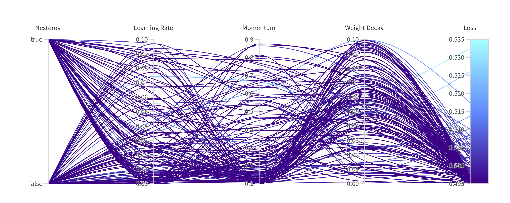

<!-- _paginate: false -->
<!-- _class: lead -->
<!-- center -->
# Physics-Informed Neural Networks
### using Curriculum Learning

---

## Background

#### What are PINNs? 

PINNs are a class of neural networks which can be used to solve partial differential equations (PDEs) by <mark>introducing physical domain knowledge into the network</mark> through the loss function.

#### What is curriculum learning?

Within this context, curriculum learning is a training strategy that <mark>gradually increases the complexity of the training data</mark>, allowing the network to train on <mark>simpler examples first</mark> and then gradually increasing the complexity.

--- 

## Research Question

Krishnapriyan, Aditi, et al. (2021) analyzed the performance of PINNs and showed improvements in learning useful information by using sophisticated approaches, such as curriculum learning.

Our aim is to build on their work, specifically on the curriculum learning approach, and investigate the <mark>effects of sampling size and noise (SNR) in the training data on the performance of PINNs</mark>.

--- 

#### Visualizing the effect of sampling size and noise
(Note that the sample are idealized, as we assume that the samples are equidistantly distributed over the domain.)

---

## Setup

#### Model 
Fully connected neural network with <mark>3 hidden layers and 50 neurons per layer</mark>. The activation function is the hyperbolic tangent function. The input of the network is the spatial coordinate $x$ and temporal coordinate $t$. The output of the network is $u(x, t)$.  (Similar to paper, but with 3 hidden layers instead of 2)

#### PDE
The PDE in the initial experiments is the <mark>Convection–Diffusion Equation</mark> with no diffusion term, a scalar convection term and sine wave as the boundary condition.  (Same as in paper) 

---

#### Loss Function
The loss function is the mean squared error (MSE) between the predicted and the actual value of the PDE and the PDE itself. The loss function is defined as follows:

$$
\mathcal{L}(\hat u, u \mid \theta) = \mathcal{L}_{\text{PDE}}(\hat u \mid \theta) + \mathcal{L}_{\text{MSE}}(\hat u, u \mid \theta)
$$

The loss function <mark>differs from the paper, where the initial condition, boundary condition and the PDE itself are used in the loss function</mark>. However, as in our experiments we sample over the whole domain, the boundary and initial conditions are represented to some degree.

---

## Approach

### Step 1: Hyperparameter Search

As our goal is to investigate the <mark>effects of sampling size and noise</mark> in the training data, the <mark>models used should be as optimal</mark> as possible. Therefore, we first find optimal hyperparameters for the optimizers. 

### Step 2: Sample Size and Noise Sweep

Using the optimal hyperparameters, we vary the sample size and noise to see how they affect the performance of PINNs with curriculum learning.

---

## Step 1: Hyperparameter Search

| Optimizer | Learning Rate | Weight Decay | Momentum | Max Iterations | History Size  |
| --------- | ------------- | ------------ | -------- | -------------- | ------------- |
| SGD       | [.0001, .1]   | [0, .1]      | [.1, .9] | -              | -             |
| Adam      | [.00001, .1]  | [0, .1]      | -        | -              | -             |
| L-BFGS    | [.01, 2]      | -            | -        | [5, 10, 20]    | [25, 50, 100] |

 (Note: The hyperparameters are found using bayesian optimization minimizing the overall loss using 250 epochs, a sample size of 100 and noise of 50dB in each curriculum step. Additionally, for L-BFGS we use the strong wolfe line search function, as in prior experiments it showed better results.) 

---

### SGD Hyperparameter Sweep

---

### Adam Hyperparameter Sweep

---

### L-BFGS Hyperparameter Sweep

---

## Step 2: Sample Size and Noise Sweep

Sample size influences the performance of PINNs, as a <mark>higher sample size</mark> allows for a possible <mark>higher resolution of the domain</mark> the corresponding <mark>model will train on</mark> (recall slide 4). Thus, increasing the sample size should increase the performance of the model, but also increase the training resources needed. Hence, we choose to investigate sample sizes of 50, 100, 250, 500 and 1000.

Noise in the training data is naturally occurring problem (e.g. faulty sensors, measurement errors, etc.). We model this noise by adding <mark>Gaussian noise modeled by the signal-to-noise ratio (SNR)</mark> to the training data. We choose to investigate SNRs of 0.1, 1, 5, 10, 20, 30, 40 respectively (the higher, the better).

 Naturally, we expect with increasing noise, that more samples are needed to achieve the same performance. 

---

### Preliminary Results: Adam

---

### Preliminary Results: L-BFGS

---

## Future Work

- Initial hyperparameter sweep need to be investigated, especially regarding
  - <mark>unrealistic assumption of almost no noise</mark>
  - <mark>sample size</mark> and <mark>influence on performance in Step 2</mark> 
- Importance and effects of the hyperparameters needs to be investigated
- <mark>Comparison</mark> of the results <mark>against the baseline</mark> (i.e. PINNs without curriculum learning)
- Different sampling strategies, model architectures and loss functions need to be investigated

---

## References

- Krishnapriyan, Aditi, et al. "Characterizing possible failure modes in physics-informed neural networks." Advances in Neural Information Processing Systems 34 (2021): 26548-26560. [arXiv preprint arXiv:2106.06860 (2021)](https://arxiv.org/abs/2109.01050)

- Our implementation and this presentation can be found at https://github.com/confusedSerge/pinn-curriculum-learning
